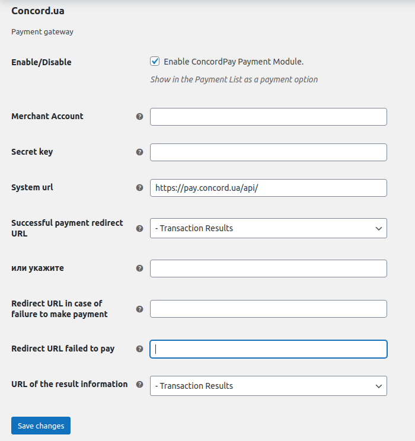

Модуль ConcordPay для WordPress WooCommerce 
=======

Перед началом установки плагина **«ConcordPay для WooCommerce»** у вас должен быть установлен плагин **«WooCommerce»** версии *5.x*.

Установка
----
1. Содержимое архива поместите в папку плагинов **WordPress** ( по-умолчанию - *{YOUR_SITE}/wp-content/plugins/* ).

2. Зайдите в админ раздел сайта (*/wp-admin/*) и активируйте плагин **ConcordPay для WooCommerce**.

3. Перейдите в раздел *«WooCommerce -> Settings -> Checkout»* (в новых версиях: *«WooCommerce -> Settings -> Payments»*).

4. Внизу страницы в пункте *«Payment Gateways»*, включите плагин и нажмите кнопку *«Manage»*.

5. Введите данные вашего продавца из личного кабинета **ConcordPay**.
   - Идентификатор продавца (Merchant ID);
   - Секретный ключ (Secret key).

*Модуль протестирован для работы с WordPress 5.8, WooCommerce 5.2.2 и PHP 7.2.*

